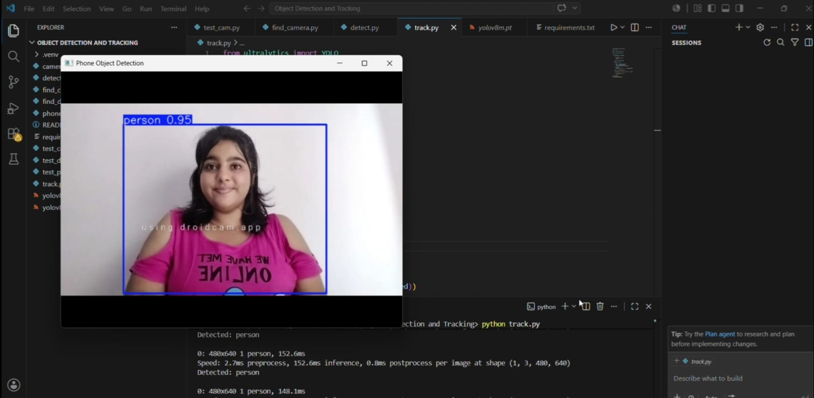
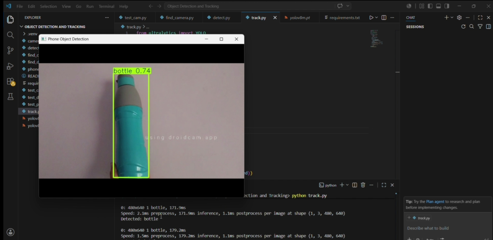
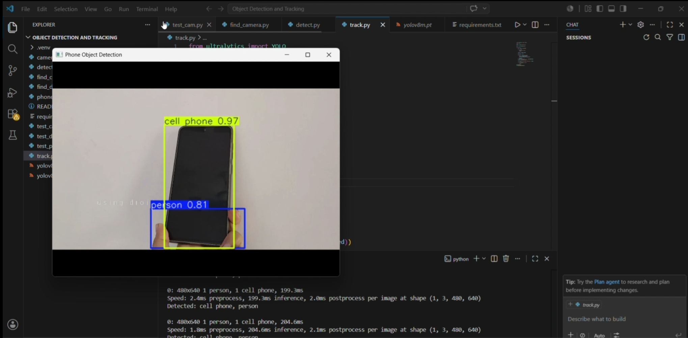
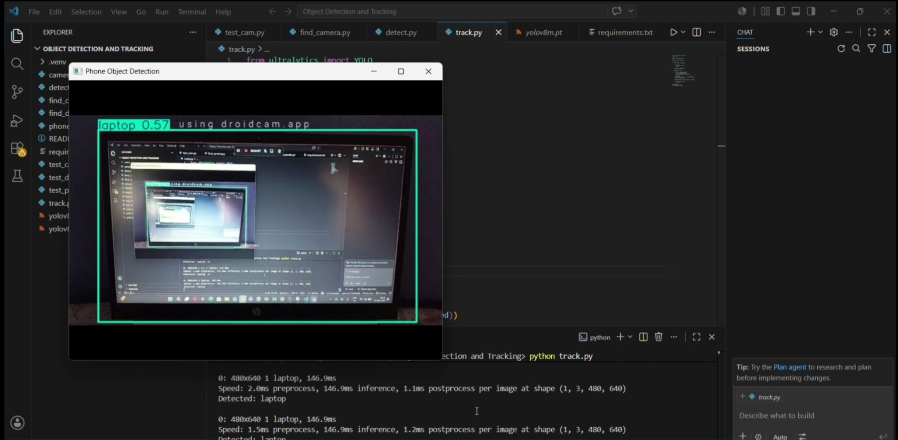
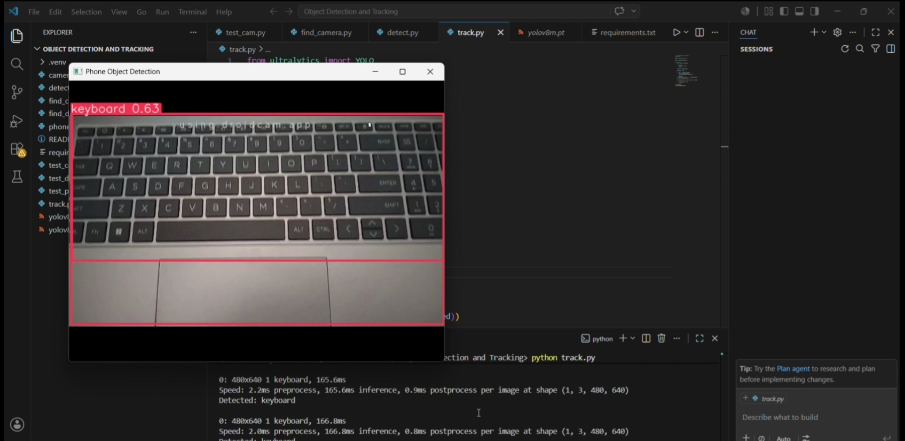

# Object Detection and Tracking using YOLOv8

## Overview

This project is a real-time Object Detection and Tracking system developed using Python, OpenCV, and YOLOv8.

The application captures live video input from a smartphone camera connected through DroidCam and detects multiple objects in real time. Detected objects are highlighted with bounding boxes and labels, while their names are also displayed in the terminal.

## Features

* Real-time object detection
* Live video input using DroidCam
* Detection of multiple objects simultaneously
* Bounding boxes and object labels
* Terminal output of detected objects
* Fast and accurate YOLOv8 inference

## Technologies Used

* Python
* OpenCV
* YOLOv8
* Ultralytics
* DroidCam

## Installation

```bash
pip install -r requirements.txt
```

## Run the Project

```bash
python track.py
```

## Detection Results

### Person Detection



### Bottle Detection



### Cell Phone Detection



### Laptop Detection



### Keyboard Detection



## Example Detections

* Person
* Bottle
* Cell Phone
* Laptop
* Keyboard

## Project Structure

object-detection-tracking/
│
├── screenshots/
│   ├── person_detection.jpg
│   ├── bottle_detection.jpg
│   ├── cell_phone_detection.jpg
│   ├── laptop_detection.jpg
│   └── keyboard_detection.jpg
│
├── track.py
├── requirements.txt
├── README.md
└── .gitignore

## Author

Vinny Gurnani